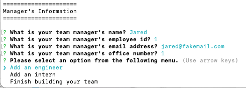

# Yurium Team Profile Generator
[](https://opensource.org/licenses/MIT)

## Description
Generates team profile nice and quick using user prompt. This will let you create a team roster consists of manager, engineers, and interns. You can have quick access to their emails and engineer's GitHub repositories!

## Table of Contents
- [Installation](#installation)
- [Usage](#usage)
- [License](#license)
- [Tests](#tests)
- [Questions](#questions)

## Installation
1) Install node
    ```bash
    install node
    ```
2) Install all dependencies
    ```bash
    npm i
    ```

## Usage
For demonstration video, click [here](https://drive.google.com/file/d/1tGo_qWp0Yo43kZIh1EgVAh76WuiahrkO/view?usp=sharing).

1) 
    ```bash
    node index
    ```
2. Provide manager's information and other members'(engineer/intern) information by answering questions shown in the command line prompt.
   - Select next option menu will be prompted every time you enter each member's information.
   - You can select an option using arrow keys and enter.
    
3. HTML file of the team profile (`index.html`) will be generated in `dist` folder after selecting `Finish building your team` option.

## License
Licensed under the [MIT License](https://opensource.org/licenses/MIT).
      

## Tests
Test all the object classes by typing `jest` in the command line prompt. And refer to the following example for testing each one.
```bash
jest employee
```
For test demonstration video, click [here](https://drive.google.com/file/d/1_OPVoEyrgqoaM208B8HOsbypjqGzS3XS/view?usp=sharing).
      
## Questions
- GitHub Profile: https://github.com/YuriI92
- If you have any additional questions, please feel free to contact me by email.
  E-mail Address: <yurichikawa1992@gmail.com>
      
  